# Settings

- [General](#general)
- [Sonarr](#sonarr)
- [Radarr](#radarr)
- [Subtitles](#subtitles)
- [Languages](#languages)
- [Providers](#providers)
- [Notifications](#notifications)
- [Scheduler](#scheduler)

## General

### Host

#### Bind Address

Valid IP4 address or '0.0.0.0' for all interfaces

> **Leave it as `0.0.0.0` if you want to listen on every available IP address (recommended). If you are running inside a docker container, that's the recommended value.**

##### Port Number

Should be an available TCP port on the computer running Bazarr. Default is 6767 and it is the recommended value.

##### URL Base

This option gives you the opportunity to serve Bazarr in a sub-directory. Ex.: `http://127.0.0.1:6767/bazarr/` instead of the default `http://127.0.0.1:6767/`

Mainly used when you use a reverse proxy, if you don't use a reverse proxy or don't know what it is leave this empty!!!

#### Security

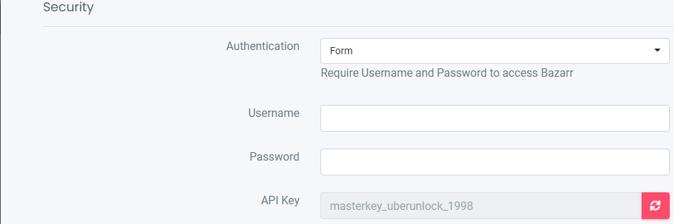

##### Authentication

Select the type of authentication process desired from basic (browser popup) or forms login. Be aware that basic auth is not secure if not used in conjunction with SSL (using a reverse proxy).

##### Username

Enter here the username to access Bazarr.

##### Password

Enter here the password to access Bazarr.

##### API Key

Your API Key.

#### Proxy

##### Type

Select the desired proxy type from HTTP(S), Socks4 or Socks5.

##### Hostname

Enter here the hostname of your proxy.

##### Port

Enter here the TCP port of your proxy.

##### Username-

Enter here the username (if required) to authenticate to your proxy.

##### Password-

Enter here the password (if required) to authenticate to your proxy.

##### Ignored addresses

Enter here (if required), a list of comma separated hostname or IPv4 addresses to be excluded from going through the proxy.

#### UI

 Self explanatory.

#### Logging

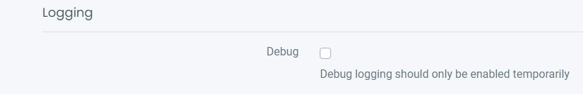

This option enables debug logging and should be enabled for a short period to facilitate debugging process.

#### Analytics

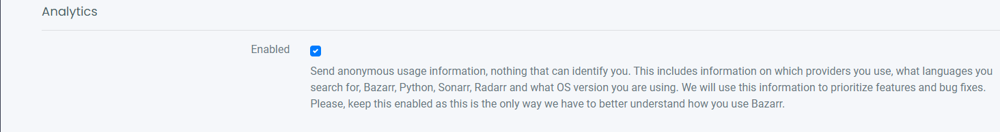

Send anonymous usage information, nothing that can identify you. This includes information on which providers you use, what languages you search for, Bazarr, Python, Sonarr, Radarr and what OS version you are using. We will use this information to prioritize features and bug fixes. Please, keep this enabled as this is the only way we have to better understand how you use Bazarr.

------

### Sonarr

#### Host-

##### Hostname or IP address

Enter the hostname or the IP address of the computer running your Sonarr instance.

> **Be aware that when using Bazarr in docker, you cannot reach another container on the same Docker host using the loopback address (ex.: 127.0.0.1 or localhost). Loopback address refer to the Bazarr Docker container, not the Docker host.**

##### Port Number-

Enter the TCP port of your Sonarr instance. Default is 8989.

##### URL Base-

Mainly used by those who expose Sonarr behind a reverse proxy (ex.: /sonarr). Don't forget the leading slash. In fact, it should look exactly the same as in Sonarr settings. Mainly used when you use a reverse proxy.

> **If you don't use a reverse proxy or don't know what it is leave this empty !!!**

##### SSL enabled

Enable this if your Sonarr instance is exposed trough SSL.

> **Not needed if you reach it with a local IP address.**

##### API key

Enter your Sonarr API key here.

> Click the `Test` button after filling in all the fields. Make sure the test is successful before you proceed.

#### Options

##### Minimum Score

Select the minimal score (in percentage) required for a subtitles file to be downloaded. *Are your subs often out of sync? Raise the score!*

##### Download Only Monitored

Automatic download of Subtitles will only happen for monitored shows/episodes in Sonarr.

##### Excluded Tags

Episodes from series with those tags (case sensitive) in Sonarr will be excluded from automatic download of Subtitles.
In Sonarr you add a custom made tag to a show, in this case the shows with these tags will be ignored by Bazarr. examples: `dutch`, `anime`

##### Excluded Series Types

Episodes from series with those types in Sonarr will be excluded from automatic download of Subtitles.
Options: Standard, Anime, Daily

#### Path Mappings

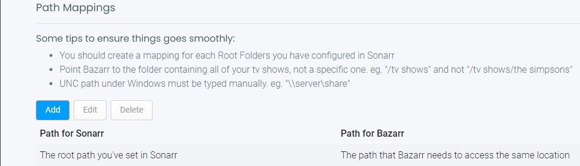

**You should only use this section if Sonarr and Bazarr use a different path to access the same episode file (.mkv).**
**(for example if you run Sonarr on a different device then Bazarr or have a Synology and mix packages with Docker.)**

> 
>
> **IF YOU GOT THE SAME VALUES ON BOTH SIDES THEN YOU DON'T NEED IT !!!**
> **IT SHOULD ALSO BE REMOVED OR ELSE YOU WILL GET A ERROR.**
>
> 

Click on `Add` and you will get a popup window
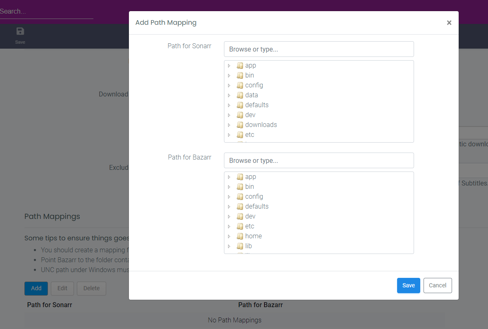

Ex.:

- Browse or type the path for Sonarr: `/media/tv_shows/seriesX/`
- Browse or type the path for Bazarr: `\\nas\tv\seriesX\

The common part of both path can be discarded and you should use those values:

- Path for Sonarr: `/media/tv_shows/`
- Path for Bazarr: `\\nas\tv\`

> *If everything runs on Docker you normally don't need to use this. Except if you have messed up path mappings and then it would be smarter to fix those first to have consistency and well planned paths.*

------

### Radarr

The same setup as you did for Sonarr except for the default Port Number: 7878

------

### Subtitles

#### Subtitles Options

##### Subtitle Folder

Choose the location where you want your subtitles to be stored, `Alongside Media File` is the recommended value.

##### Upgrade Previously Downloaded Subtitles

Schedule a task to upgrade Subtitles previously downloaded by Bazarr.

##### Number of days to go back in history to upgrade subtitles (up to 30)

Number of days to go back in history to upgrade Subtitles (up to 30).

##### Upgrade Manually Downloaded Subtitles

Enable or disable the upgrade of manually searched and downloaded subtitles.

#### Anti-Captcha Options

 **Some providers require a Anti-Captcha when using their API.**

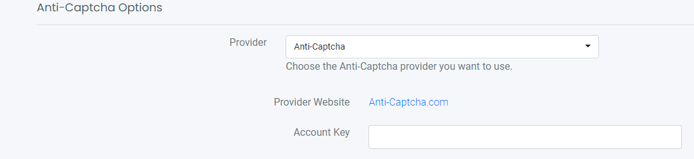

Choose the Anti-Captcha provider you want to use. and add the necessary credentials.

> We recommend [Anti-Captcha.com](https://anti-captcha.com/).

#### Performance / Optimization

 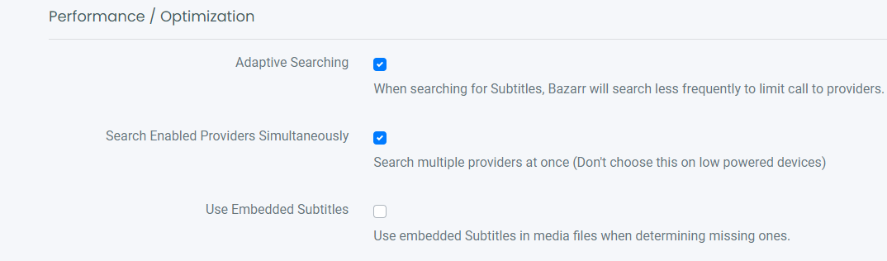

##### Adaptive Searching

When enabled, Bazarr will search less frequently to limit API calls to providers.
This option enables search on a weekly basis for episodes or movies that are unsuccessful after 4 weeks.

##### Search Enabled Providers Simultaneously

Search multiple providers at once (Don't choose this on low powered devices)

##### Use Embedded Subtitles

When disabled, this option forces Bazarr to not take care of embedded subtitles when deciding if a language is missing.

When enabled you several extra options

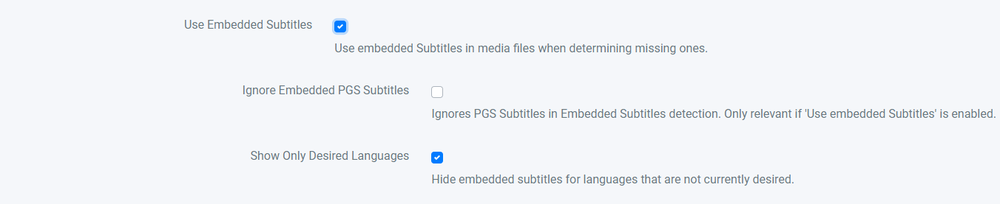

##### Ignore Embedded PGS Subtitles

When enabled it Ignores PGS Subtitles in `Embedded Subtitles` detection. Only relevant if `Use embedded Subtitles` is enabled.

##### Show Only Desired Languages

When enabled it hides embedded subtitles for languages that are not wanted.

#### Post-Processing

 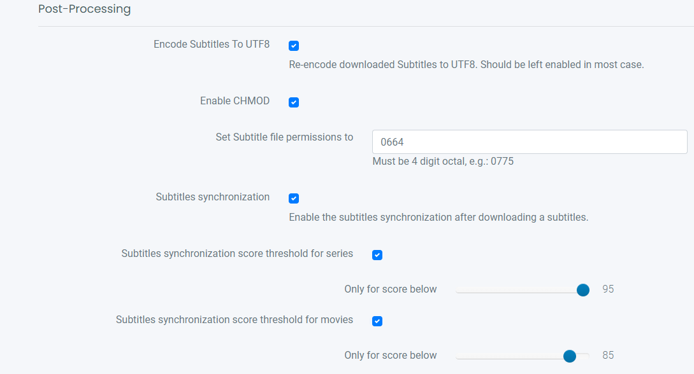

##### Encode Subtitles To UTF8

Re-encode downloaded Subtitles to UTF8. Should be left enabled in most cases.

##### Enable CHMOD

This option,it is only available on *nix based operating systems, gives the possibility to set permissions on subtitle files created by Bazarr.

##### Subtitles synchronization

Enable the subtitles synchronization after downloading a subtitles.

##### Subtitles synchronization score threshold for series

Only synchronize the subtitles if the score is below your chosen score.

##### Subtitles synchronization score threshold for movies

Only synchronize the subtitles if the score is below your chosen score.

#### Use Custom Post-Processing

  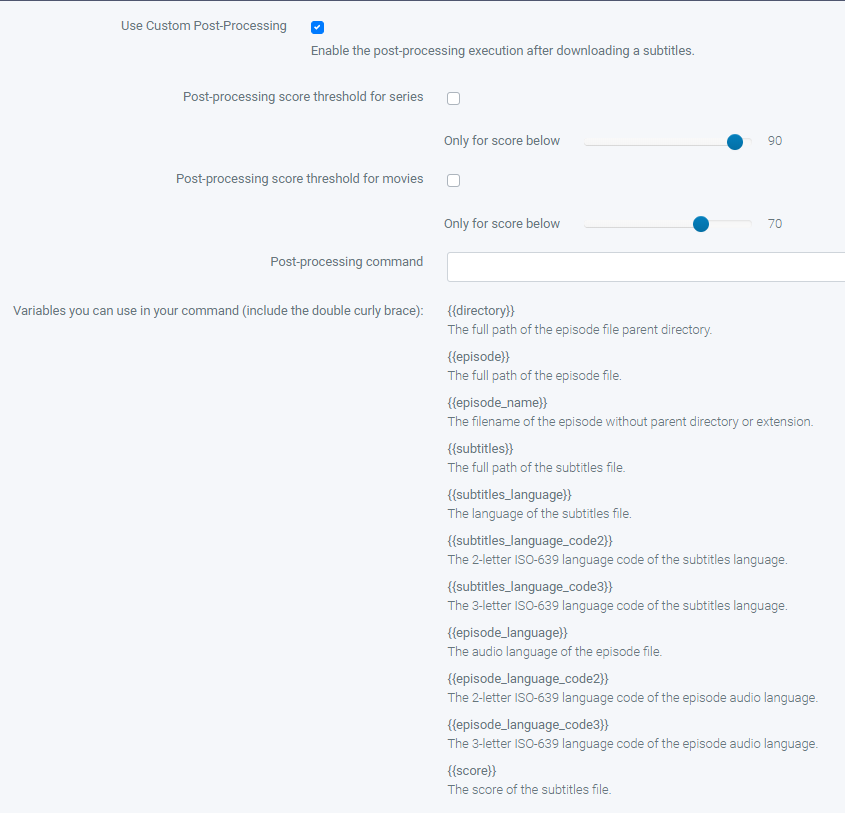

##### Use Custom Post-Processing-

Enable the post-processing execution after downloading a subtitles.

##### Post-processing score threshold for series

Only runs Post-processing if the score is below your chosen score.

##### Post-processing score threshold for movies

Only runs Post-processing  if the score is below your chosen score.

##### Post-processing command

Enter in this field the script or binary path to execute with the desired arguments. Please be aware that double-quote could be necessary around arguments.

**Be aware that your command cannot start or end with quote/double-quote. You must append something like `2>&1` to the end of your command.**

------

### Languages

#### Subtitles Languages

 

##### Single Language

We don't recommend enabling this option unless absolutely required (ie: media player not supporting language code in subtitles filename). Be aware the language code (ex.: en) is not going to be included in the subtitles file name when enabling this.

> **Recommended value is off**

##### Enabled Languages

Select the languages you want to be able to use in Bazarr. This doesn't add any required languages to series or movies, it just filter out the language list everywhere in the UI to have a more readable drop-down.

#### Default Settings

 

##### Series Default Setting

Enable the automatic selection of desired languages for new series added **after** the activation of this option.

###### Languages-

 Select the languages to be added to required languages for new series.

###### Hearing-impaired

 Enable this to require hearing-impaired subtitles instead of standard one.

##### Forced

Forced subtitles are the subtitles appearing on screen when the characters speak a foreign or alien language, or there is a sign, location, or other text in the scene.

- Like Dothraki in Game of Thrones.
- Star Trek when someone speaks Klingon.

 Values:

- False: Search for normal subtitles.
- True: Search for only forced subtitles. (keep in mind that forced subs aren't available in every languages and are hard to find).
- Both: Search for normal subtitles and forced subtitles.

##### Movies Default Setting

Same as for series.

------

### Providers

 

Select the subtitles providers you would like to enable. It is best to select multiple providers and create/use a account with them especially when you have a lot of wanted subtitles.
Some subtitle providers requires a extra paid Anti-Captcha Service.

> ***If possible don't forget to support them for their free service***

------

### Notifications

For each notification provider, you need to enable (if desired) and, in the corresponding input field, provide a valid config string as described in Apprise [wiki](https://github.com/caronc/apprise/wiki).

------

### Scheduler

#### Sonarr/Radarr Sync

 

##### Update Series list from Sonarr

How often to sync with Sonarr for new Series

##### Update Episodes list from Sonarr

How often to sync with Sonarr for new Episodes

##### Update Movies list from Radarr

How often to sync with Radarr for new Movies

#### Disk Indexing

 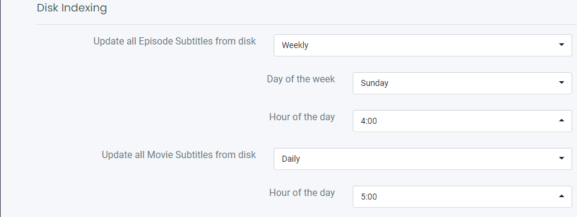

##### Update all Episode Subtitles from disk

How often should Bazarr Update all Episodes Subtitles from disk

- Daily
- Weekly
- Manually

###### Day of the week

Which day of the week

###### Hour of the day

Which hour of the day

##### Update all Movie Subtitles from disk

Same as series

#### Search and Upgrade Subtitles

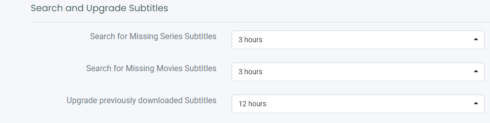

##### Search for Missing Series Subtitles

How often should Bazarr Search for Missing Series Subtitles

##### Search for Missing Movies Subtitles

How often should Bazarr Search for Missing Movies Subtitles

##### Upgrade previously downloaded Subtitles

How often should Bazarr upgrade previously downloaded Subtitles
