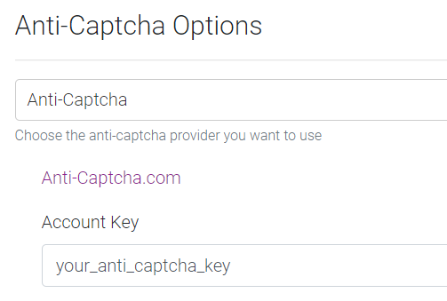

# FAQ

## Where can I find the logs or database

??? faq "Where can I find the logs or database?"

    You can find the location for your database and log file in the following location depending where and how you installed it.

    **Windows Installation:** `%programdata%\Bazarr`

    **Dockers:** `/config/db` and `/config/log`

    **Source and other Installation:** `data directory inside bazarr root directory`

## This path doesn't seems to be valid

??? faq "This path doesn't seems to be valid?"

    If you're getting a error that looks like this:

    

    This can be for various reasons we've collected the the most common ones depending on the used OS.

    ### Windows

    - **Bazarr service runs under Local System account that won't be able to access network shares.**

        Run Bazarr's service as another user that has access to that share.  You need to change the account used for Bazarr service in `services.msc` console.

    - **You're using a mapped network drive (not a UNC path).**

        Change your paths to UNC paths (`\\server\share`) both in Sonarr, Radarr and Bazarr will be able to access those files.

    ### Docker

    - **Your docker containers volume paths don't match with Sonarr/Radarr**

        make sure Bazarr uses the identical volume paths as Sonarr and Radarr.

    ### Docker & Synology when mixing packages with dockers

    - In worse case scenario you need to make use of [Paths Mapping](https://github.com/morpheus65535/bazarr/wiki/Settings#path-mappings)

    !!! note

        *If you're using docker and get this warning and need help with it provide us with the docker compose or docker build command of Bazarr and Sonarr/Radarr !!!*

        *If you're using a system with a GUI(Synology, unRAID, OMV, etc.) to configure docker use one of the following from terminal(puTTy) to get the docker compose or docker build command.*`

         `sudo docker run --rm -v /var/run/docker.sock:/var/run/docker.sock red5d/docker-autocompose CONTAINER_NAME`

        *And yes this even works on a Synology*
        *if you don't know how you probably didn't read the [[Installation-Synology]](/Getting-Started/Installation/Synology/synology/)*

## Why (or) do I need the Anti-Captcha

??? faq "Why (or) do I need the Anti-Captcha?"

    ***Some providers require a Anti-Captcha when using their API.***

    

    Choose the Anti-Captcha provider you want to use, and add the needed credentials.

    We recommend [Anti-Captcha.com](https://anti-captcha.com/).

## Why doesn't Bazarr find any subtitles

??? faq "Why doesn't Bazarr find any subtitles?"

    Please check if you've configured the following settings.

    [[First time installation configuration]](/Getting-Started/First-time-installation-configuration/)

## How do I enable the debug log

??? faq "How do I enable the debug log?"

    `Settings` => `General`
    

## How to report a problem

??? faq "How to report a problem?"

    1. Start with enabling the debug log.
    1. Clear your logs and then try to replicate your issue.
    1. Paste your logs on one of the following sites.
        - <https://gist.github.com/>
        - <https://hastebin.com/>
        - <https://pastebin.com/>
    1. Follow the steps provided in [[Asking for help or report a problem]](/Troubleshooting/Asking-for-help-or-report-a-problem/)

## I'm a cloud user or run on a low powered device

??? faq "I'm a cloud user or run on a low powered device?"

    We've collected a few Tips & Tweaks that could help, you can find them in [[Performance-Tuning]](/Additional-Configuration/Performance-Tuning/)

## What are Forced Subtitles

??? faq "What are Forced Subtitles?"

    Forced subtitles is the subtitle appearing on screen when the characters speak a foreign or alien language, or there is a sign, location, or other text in the scene.

    - Like Dothraki in Game of Thrones.
    - Star Trek when someone speaks Klingon.

## What are Embedded Subtitles

??? faq "What are Embedded Subtitles?"

    Embedded subtitles are subtitles that are in the video container (mkv, mp4, etc)

    they can be different formats in the container ex. .srt, PGS, etc

## How do I reset my password

??? faq "How do I reset my password"

    Edit your config.ini and change your auth type to None and restart Bazarr.

    

    Your config.ini can be found in your [in the same location where your logs or database are](#where-can-i-find-the-logs-or-database)

## Which external subtitles does Bazarr recognize

??? faq "Which external subtitles does Bazarr recognize?"

    Bazarr recognizes the following external subtitles during a disk scan to match which language subtitles you already got.

    `.srt`, `.sub`, `.smi`, `.txt`, `.ssa`, `.ass`, `.mpl`, `.vtt`

## I'm missing or want a subtitle provider added to Bazarr

??? faq "I'm missing or want a subtitle provider added to Bazarr?"

    You're missing a subtitle provider or want one added to Bazarr ?
    Well you got several ways to do that.

    1. The fastest:

        Learn Python and create a provider script for Bazarr.

        You can can look in the source code which [providers](https://github.com/morpheus65535/bazarr/tree/master/libs/subliminal_patch/providers) we got and working on.

        If you need to write one then you can use the 2 following templates depending what the provider supports.

        - [API-Template](https://github.com/morpheus65535/bazarr/blob/master/libs/subliminal_patch/providers/napisy24.py)

        - [Page-Scrapping-Template](https://github.com/morpheus65535/bazarr/blob/master/libs/subliminal_patch/providers/soustitreseu.py)

        !!! tip

            If API is supported it is preferred.

            Why ?

            Easier Error management and Scrapping the site is more resource intensive.

    1. The slowest:

        [Bazarr Feature Request](https://bazarr.featureupvote.com/)
        First check if no one else already requested it of no one requested it you can create a new Feature Request, make sure to use a clear topic and use a good description and why etc.

        !!! NOTE

            **Keep in mind it doesn't mean it will happen, created or added !!!**

            **We highly discourage you from requesting providers in the Discord/Github.**

            **It will be ignored or forgotten !!!**

## I would like to see the following Feature in Bazarr

??? faq "I would like to see the following Feature in Bazarr"

    Go to [Bazarr Feature Request](https://bazarr.featureupvote.com/)

    First check if no one else already requested it of no one requested it you can create a new Feature Request, make sure to use a clear topic and use a good description and why etc.

    !!! NOTE

        ***Keep in mind it doesn't mean it will happen, created or added !!!***

## Synchronization failed

??? faq "Synchronization failed...."

    If you have left over `*.synced.*` files or if you get the following error or similar:

    `Synchronization failed; consider passing --max-offset-seconds with a number larger than 600`

    This Should be reported to [smacke ffsubsync Github](https://github.com/smacke/ffsubsync) by providing the subtitles synchronization debug log that is created by enabling `Subtitles synchronization debugging` in Settings-->Subtitles.

    !!! NOTE

        This isn't a issue we can fix or do anything about it ourselves, So no need to report to us
